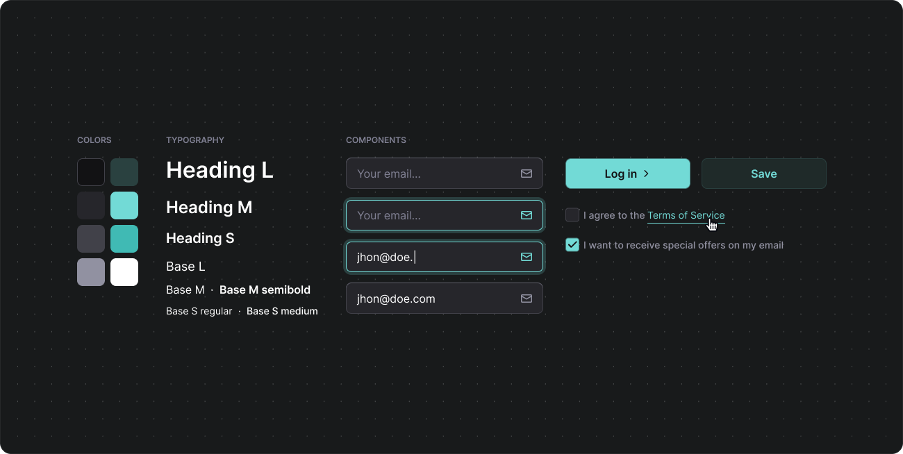
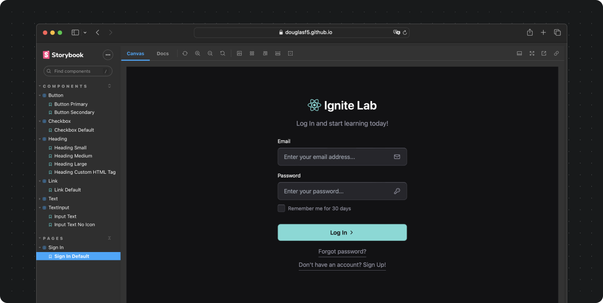

# Petit Components Library - Experiment from Ignite Lab React

- [About](#about)
- [Project screenshot](#mobile-client)
- [Installation](#installation)
- [Extra notes](#extra-notes)

 

## About

A really tiny components library. Exercise from Ignite Lab React.

- Typescript
- Vite
- Figma
- ReactJS
- TailwindCSS
- Storybook
- Radix UI
- Storybook Deployer
- GitHub Actions
- GitHub Pages

 

 

 

 

## Installation

- Navigate to an application root directory (mobile, server or web)
- Install dependencies by running `npm install`
- Run the application with `npm run dev`

Two things to keep in mind:

- You may install and run the server before running the client apps
- As of today, none of the applications in this project is ready for deployment

 

## Extra notes

- As an exercise, this project wasn’t focused on advanced optimizations regarding data storage, processing, accessibility, scalability, cross-browser compatibilities, etc. There’s still a lot to be done about it.
- As most projects, this one is not bug/error-free. If you find any bug or unexpected behavior, feel free to get in touch, here is my email - dfaferreira46@gmail.com
